# Ransomware

## Scenario
After the excitement of yesterday, Alice has started to settle into her new job. Sadly, she realizes her new colleagues may not be the crack cybersecurity team that she was led
to believe before she joined. Looking through her incident ticketing queueshe notices a “critical” ticket that was never addressed. Shaking her head, she begins to investigate.
Apparently on August 24th Bob Smith (using a Windows 10 workstation named we8105desk) came back to his desk after working-out and found his speakers blaring (click below to listen), 
his desktop image changed (see below) and his files inaccessible.

Alice has seen this before... ransomware. After a quick conversation with Bob, Alice determines that Bob found a USB drive in the parking lot earlier in the day, 
plugged it into his desktop, and opened up a word document on the USB drive called "Miranda_Tate_unveiled.dotm". With a resigned sigh she begins to dig into the problem...

## Write Up

1. check sourcetype as usual: | metadata type=sourcetypes | fields sourcetype

### Q.1 What was the most likely IPv4 address of we8105desk on 24AUG2016?

First lets start narrowing down the date to 24/08/2016 and search with the string we8105desk, we got a lot of returns with 2 likely iP addresses. lets use sysmon logs to confirmt the machine IP.
So it is confirmed that the IP is: 192.168.250.100

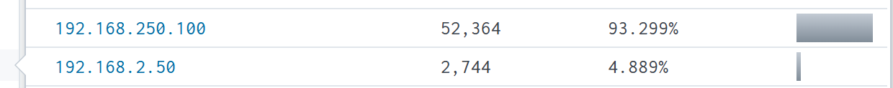

### Q.2 Amongst the Suricata signatures that detected the Cerber malware, which one alerted the fewest number of times? Submit ONLY the signature ID value as the answer.

index=botsv1 soucetype=suricata cerber | stats count by suricata sig id

We will get this by looking at suricata's log and putting the string "cerber", and then use the `stats count by` command with the signature_id field

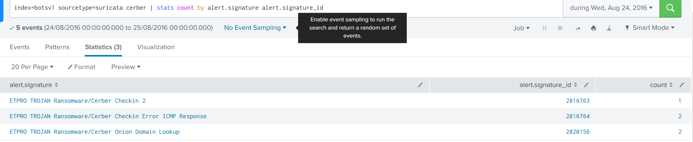

### Q.3 What fully qualified domain name (FQDN) does the Cerber ransomware attempt to direct the user to at the end of its encryption phase?

sysmon logs have all dns query logs. If it is not on, then use stream:dns logs, and since we most likely looking at A records, we can specify the query type, and we can look at the actual query for the FQDN

Since the question is related to domain names, we will use dns logs, it is most likely a IPv4 so we will use the query_type as A and include the machine IP. After that we can make a table with all the queries made with the time and destination IP addresses.

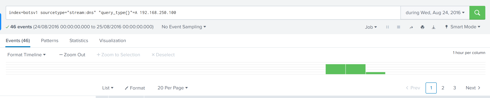
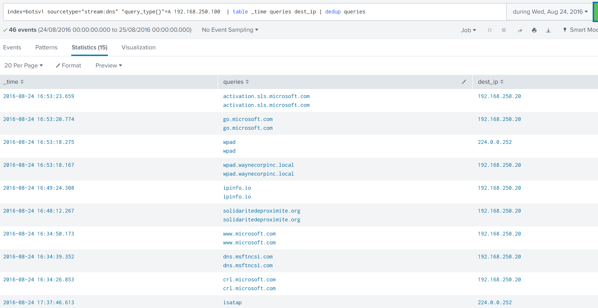
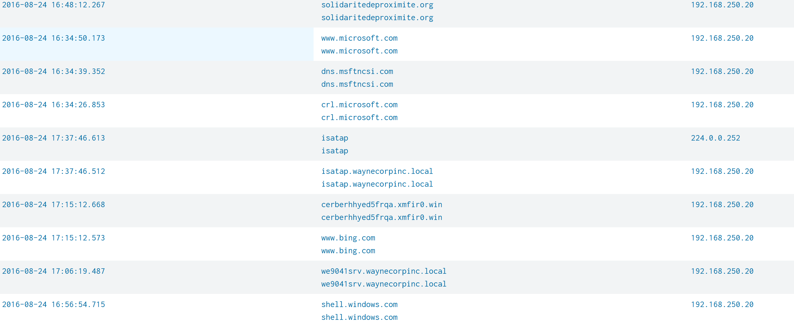

### Q.4 What was the first suspicious domain visited by we8105desk on 24AUG2016?

add _time to the above field and see, the sus website is accessed at 16:48:12

### Q.5 During the initial Cerber infection a VB script is run. The entire script from this execution, pre-pended by the name of the launching .exe, can be found in a field in Splunk. What is the length of the value of this field?

use sysmon logs process creation, and use visual basics extension, make a table of the cmd used and count the cmd length

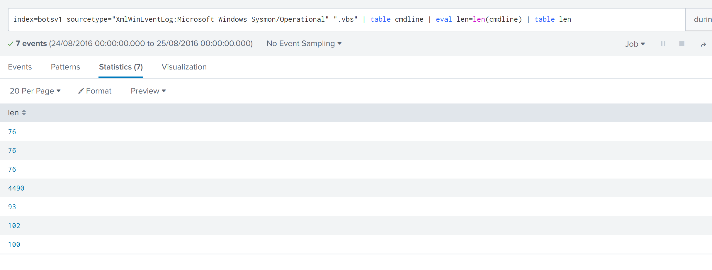

### Q.6 What is the name of the USB key inserted by Bob Smith?

This question needs a bit of searching to see what hive and key does the usb changes. you can see this [link](https://www.magnetforensics.com/blog/artifact-profile-usb-devices/), there is a few, so it is a matter of trying it out until you find the answer.

In the search we will use sourcetype of registry with the most possible hive location with wildcard and host eq to we8105desk, which will return 2 events. The answer is in the event with action: modified

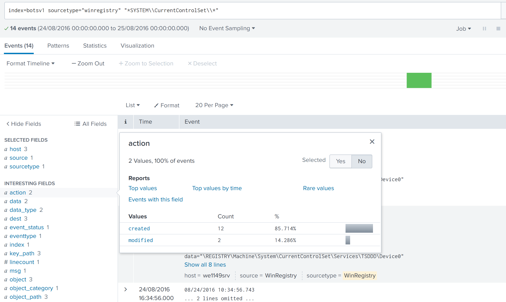
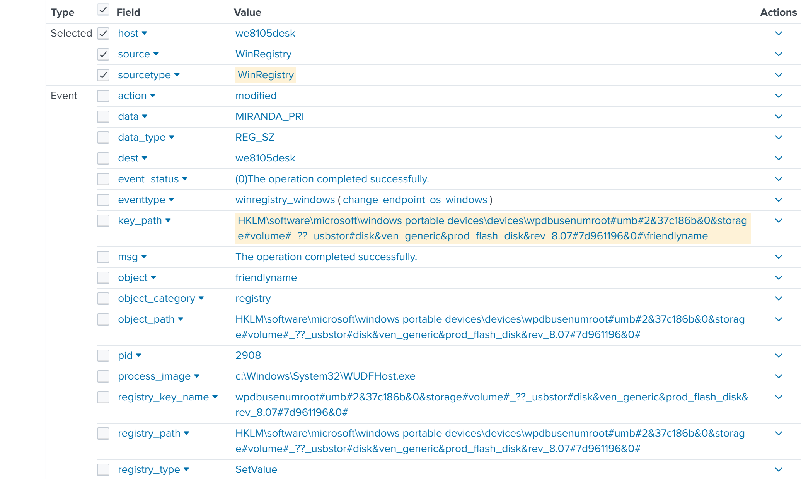

### Q.7 Bob Smith's workstation (we8105desk) was connected to a file server during the ransomware outbreak. What is the IPv4 address of the file server?

look at smb sourcetype for file sharing, also using the source ip index=botsv1 sourcetype="stream:smb" src_ip="192.168.250.100". Checking the destination IP will return a very likely answer.

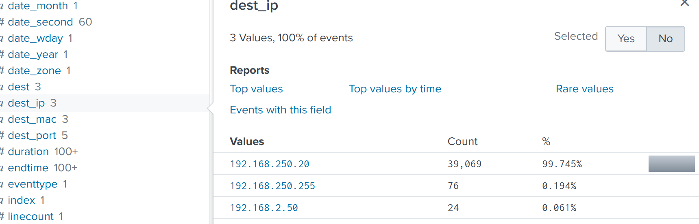

### Q.8 How many distinct PDFs did the ransomware encrypt on the remote file server?

we will use windows event logs with * and pdf extensions to start, after that, we want to narrow down by adding the server hostname (we9041srv) and also to make sure all traffic is related to the infected machine we will add the IP 192.168.250[.]100 as well. We will then make a table and delete the duplicates before counting it.

(make sure to put source IP in to get 257 not 258)

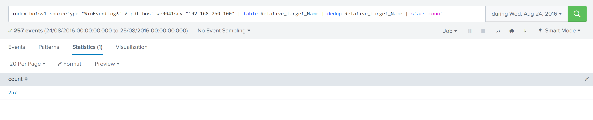

### Q.9 The VBscript found in question 5 launches 121214.tmp. What is the ParentProcessId of this initial launch?

use sysmon, create a table with parent proc, image (image is the location of the executable, or what is being executed) and commandline

This is a very tricky question, lets start by using sysmon logs and 121214.tmp as the search. There are way too many logs here, however, if we look back to Q.5 the script will first call cmd.exe to initial, that means the parent process has to be cmd. So we can add the process field as cmd and we get 3 events back. Out of the 3 there are 2 possibilities. 
The earlier one in the timeline is the answer.

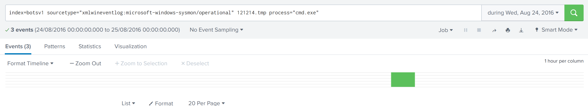
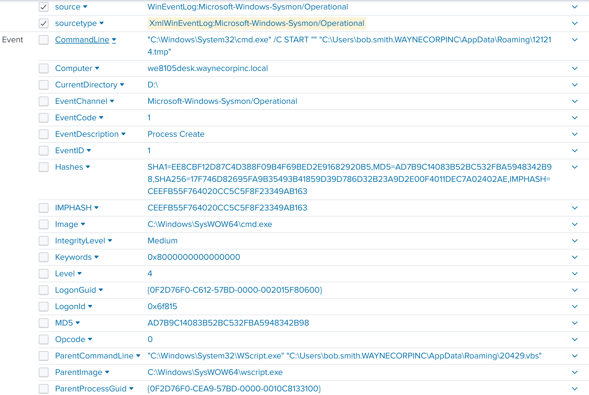
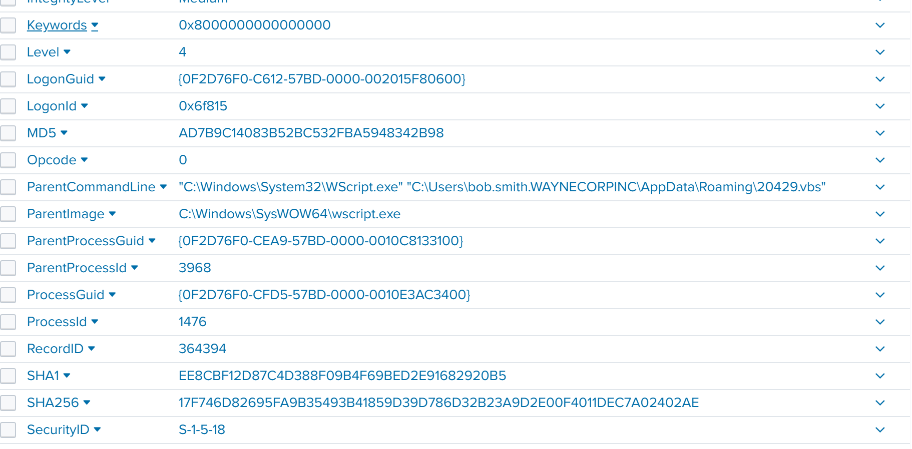

### Q.10 The Cerber ransomware encrypts files located in Bob Smith's Windows profile. How many .txt files does it encrypt?

- sysmon
- *.txt
- bob smith
- we8105desk
- sysmon event code 2: any modification to a file will change the creation time

Also a fun question, we will start with looking at sysmon logs, with *.txt, with the host we8105desk. So looking at the EventID there are code 1 and code 2. Code 1 is process creation, while Code 2 is when a file is modified. Lets check out code 2.
Looking at file_path, we see some of it is not related to Bob Smith, therefore, we would add file_path must include bob smith to the query

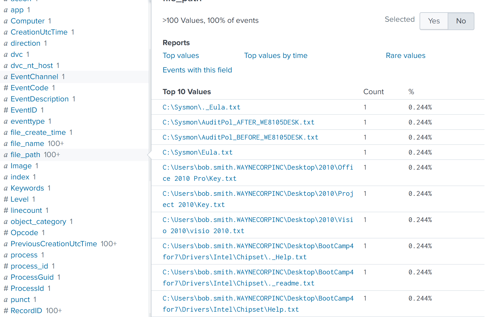
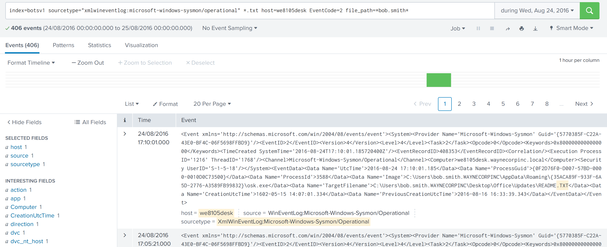

### Q.11 The malware downloads a file that contains the Cerber ransomware cryptor code. What is the name of that file?

So with this question, the Q.3 answer will come in handy, we know that the file must come from the either 2 suspicious FQDN, thus we can search each of them for http traffic. 

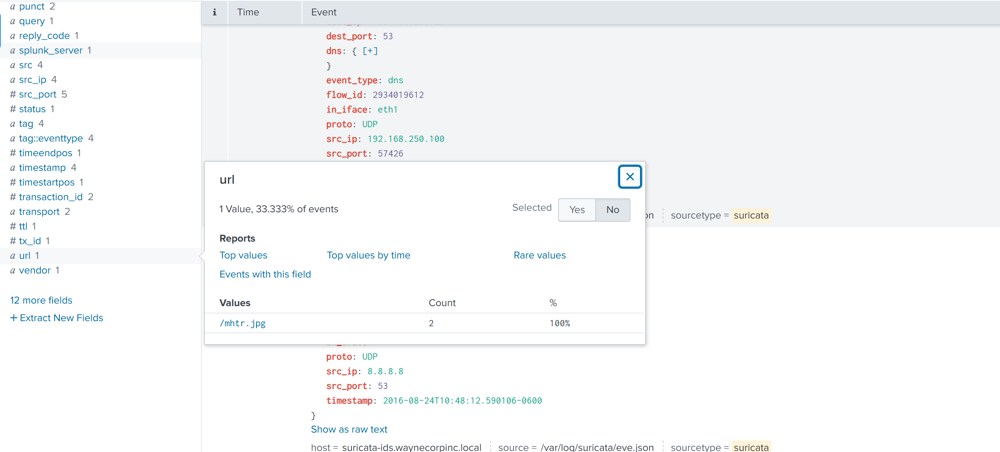

### Q.12 Now that you know the name of the ransomware's encryptor file, what obfuscation technique does it likely use?

Since the above file is an image, it is clear that the technique is steganography
